### 一.管理第三方数据源的demo

> - druid
>
> - c3p0

### 二.外部配置配件,一键配置数据库链接

> (1) 在applicationContext.xml的头部信息开辟一个namespace:statement -> xmlns:context, 然后写上如下图所示:
>
> 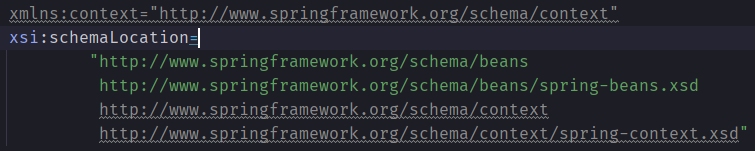
>
> 然后这样配置上
>
> 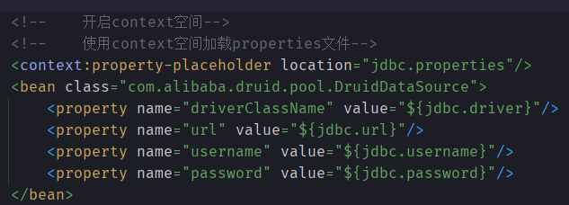
>
> 注意,假如我们的配置文件书写不规范,与运行环境系统下的某些变量名字冲突了,如果不传入下图字段
>
> 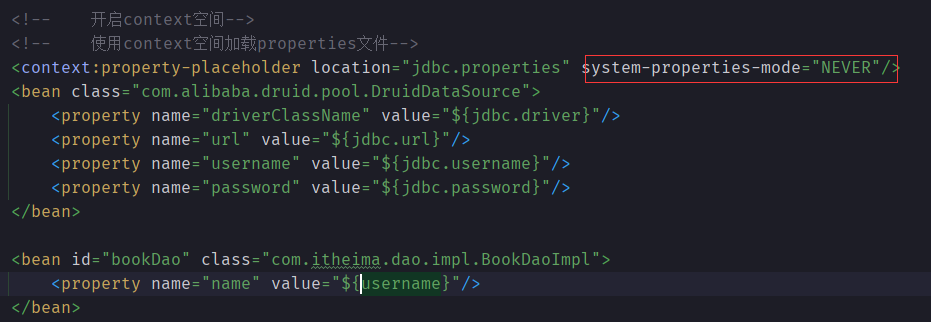
>
> 就会获取到运行环境系统的冲突变量的值
>
>
> (2)如果想要传入多个properties文件,我们可以在`location`下以逗号`,`分割,传入多个值
>
> 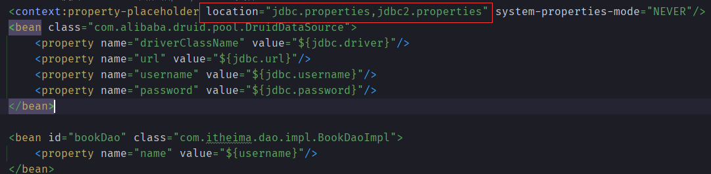
>
> 也可以这样:
>
> 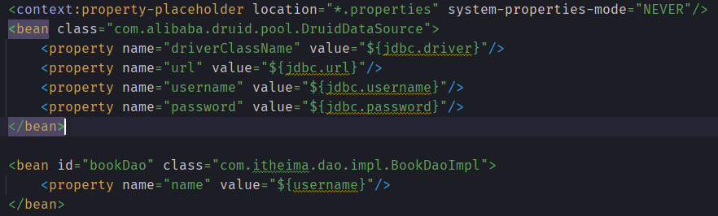
>
> 最规范最好的格式:
>
> 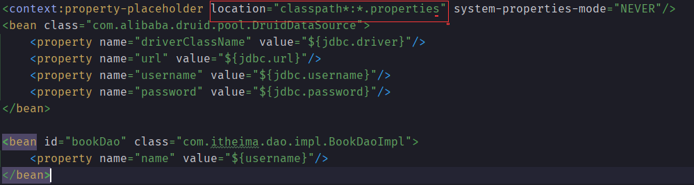
>

### 三.容器

> 1.加载配置文件的两种方式
> - 相对路径 `ClassPathXmlApplicationContext()`
> - 绝对路径 `FileSystemXmlApplicationContext()` 不推荐
>
> 2.获取bean的三种方式
>
> 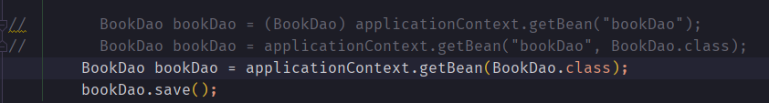
>
> 其中第三种方式,假如容器中非单例的初始化了两个或以上**同一个bean**,像这样
>
> 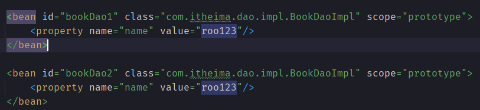
>
> 会出现
> `Exception in thread "main" org.springframework.beans.factory.NoUniqueBeanDefinitionException: No qualifying bean of type 'com.itheima.dao.BookDao' available: expected single matching bean but found 2: bookDao1,bookDao2`
> 不知道哪个需要获取了

### 四.注解开发

> - 给bean加上一个注解`@Component`, 最好加上一个唯一标识,之后实例化bean的操作不变
>
> 为了更好的区分组件之间的功能以及作用,`@Component`他有三个子注解(功能相同,名字不同), 如下
>
> `@Service` 业务层
>
> `@Repository` 数据层
>
> `@Controller` view层

### 五.纯注解开发(干掉配置文件和.properties文件)

> - 创建一个config层指定一个类SpringConfig,加上`@Configuration`, 这样这个类就是配置文件了,
    > `@Configuration`实际上代替了xml里的头部信息
>
> - 注册容器的时候方式由`ClasPathXmlApplicationContext()`变成`AnnotationConfigApplicationContext()`,
    > 传入对应配置类的字节码文件即可.
>
> 组件(bean)扫描等一系列功能怎么使用呢?(在SpringConfig类上操作)
>
> (1) `@ComponentScan` : 扫描组件注解, 传单参的时候无所谓,多参的时候是以字符串数组的方式传入.
> 
> (2) `@Scope` : 传入`singleton`是单例,传入`prototype`是非单例
> 
> (3) `@PropertySource` 字符串数组传入多个properties文件，同时不允许通配符*，用的时候这样写`${}`即可，
> 某些情况下加上`classpath*:`

### 六.注解式开发下的bean的生命周期

> 与之前的bean生命周期无差别，但是代码量减少了。
> 
> 只需要增加`@PostConstruct`和`@PreDestroy`在任意方法前面即可
> 
> `@PostConstruct`在构造方法之后运行.
> 
> `@PreDestroy`程序退出之前运行
> 
> 注意：@PostConstruct和 @PreDestroy注解位于 java.xml.ws.annotation包是Java EE的模块的一部分。
> J2EE已经在Java 9中被弃用，并且计划在Java 11中删除它。 因此需要导入maven坐标

### 七、注解式开发下的依赖注入

> （1）在**setter方法**上面放`@AutoWired`时是按找名称（setter方法去掉set后的名称）找到并注入的。
> 
> （2）在**属性（引用类型）**上放`@AutoWired`是按找类型自动注入，这个时候如果有两个及以上对同一个dao接口实现的bean，
> 这样属性会找不到类型而报错，但是他有优点减少了代码量，我们只要在所要注入的属性上加上`@AutoWired`即可完成注入。
> 
> - 上面（2）的问题可以用`@Qualifier`来解决，用于指定那个名称的bean进行注入，要跟`@AutoWired`配合使用
> 
> （3）在**属性（基本类型）**上放`@Value`就能注入值。

### 八、注解式开发第三方bean管理

> 在配置类新建一个JdbcConfig里面声明一个方法，返回的是DataSource接口，new一个第三方数据源对象，第三方数据源是这个接口的实现类，
> 只要返回其对象，最后给这个方法上一个`@Bean`注解，将这个配置类导入到SpringConfig，用的是`@Import`注解，导入即可。
> 
> - `@Import`注解：多参传入请使用数组的形式。
> 
> 简单类型的注入如下图：
> 
> 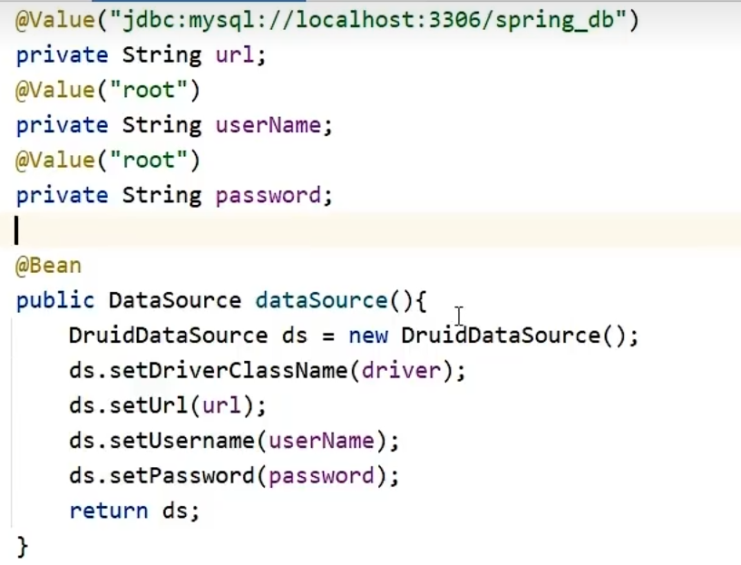
>
> 引用类型注入如下图：
> 
> 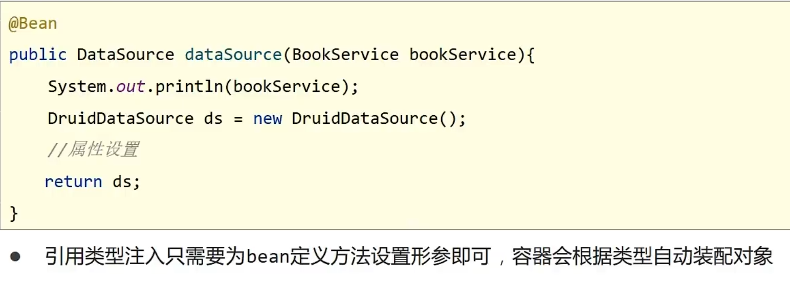

### xml配置与注解配置对比

> 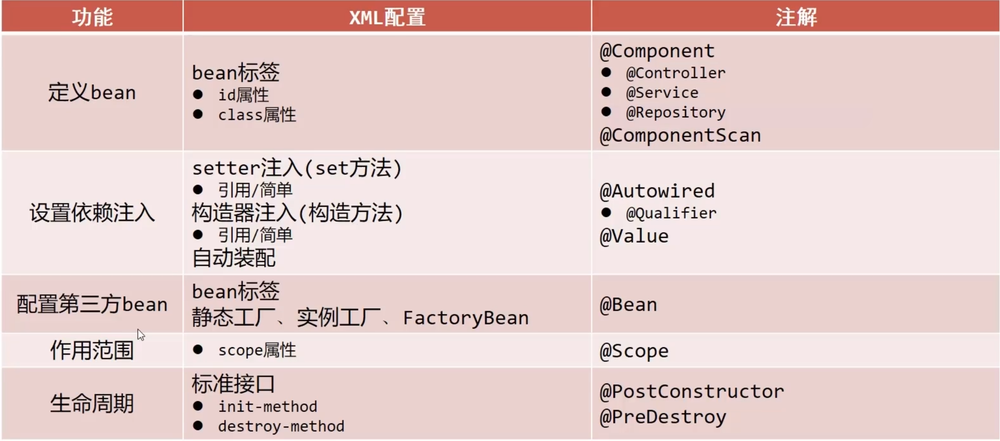
